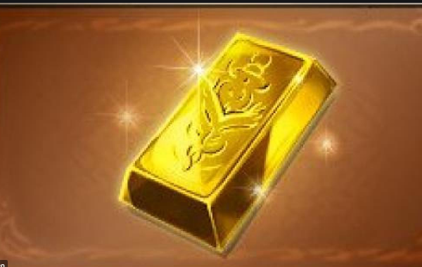

## 5. 単語、雑学集

### 5-1. 武器系

* リミ武器
    * ガチャのみで排出されるlimited武器の略称
    * 4凸しないといけないが、めちゃくちゃ強い
* 杉田玉
    * ブルースフィアの俗称
    * 水のlimited武器。
    * 強い
* ミュル
    * ミュルグレスの略称
    * 水のlimited武器。
    * 強い
* グラシ
    * グラシーザーの略称
    * 闇のヴィンテージ武器（limtedなみに強い）
    * 最近の流行ではなくなった
* エッケ
    * エッケザックスの略称
    * 火の武器
    * フラムグラスやシヴァが落とす
    * ドロップ率は悪いが４，５本そろえるとなかなか強い
    * でも労力に見合あう強さかどうかは・・・
* オッケ
    * オールドエッケザックスの略称
    * 同上
* マグナ武器
    * ザンクティンゼル島にいるマグナ系のボスからドロップできる武器
* マグナ2武器
    * 87章,89章にいる以下のボスからドロップできる武器
        * シヴァ
        * エウロペ
        * グリームニル
        * ゴッドガードブローディア
        * メタトロン

### 5-2. 召喚石系

* マグナ編成
    * 以下の召喚石の組み合わせ

|自分の召喚石|フレンドの召喚石|
|:--:|:--:|
|4凸マグナ|属性石|
|属性石|4凸マグナ|

* 神石編成
    * 以下の召喚石の組み合わせ

|自分の召喚石|フレンドの召喚石|
|:--:|:--:|
|4凸神石|属性石|
|属性石|4凸神石|
|4凸神石|4凸神石|

* 神石
    * オプティマスシリーズの召喚石
        * 火：アグニス
        * 水：ヴァルナ
        * 土：ティターン
        * 風：ゼピュロス
        * 光：ゼウス
        * 闇：ハデス

* 属性石：〇〇属性が攻撃力XXX％UP
    * 一番強い
        * 火：シヴァ
        * 水：エウロペ
        * 土：ゴッドガードブローディア
        * 風：グリームニル
        * 光：ルシフェル
        * 闇：バハムート
    * そこそこ強い
        * 火：白純の霊蝶シルフ
        * 水：気高き水神ポセイドン
        * 土：破格の戦記マルドゥーク
        * 風：愛と戦いの神アナト
        * 光：三知一鎧の賢者マギ
        * 闇：冥界の三魔犬ケルベロス
    * ぎり使える（属性石をそろえる必要あり）
        * 火：ザオシェン
        * 水：カツオ（こいつだけくっそ強い）
        * 土：アンクシャ
        * 風：シャインホークガルラ
        * 光：アドラメレク
        * 闇：ナハト

* 両面XX
    * 自分の召喚石とフレンドの召喚石を同じものを使う

### 5-3. クエスト系

#### 気軽に入って問題ないやつ

* よわバハ
    * プロトタイプバハムートの略称
    * 30人参加かつ強い人も結構くるのでワンパンだけしても怒られない
* つよバハ
    * プロトタイプバハムートHLの略称
    * 18人で参加するマルチだが、とにかくHPが多い
    * 満員になることはほぼないので、欲しい素材があったら気軽に参加しよう  
    →怒られないけどなるべくワンパンじゃなくてしっかり殴ってあげよう
* アルバハ
    * アルティメットバハムートの略称
    * 30人参加かつ強い人も結構くるのでワンパンだけしても怒られない
    * もらえる素材がくそおいしいのでマルチで見かけたら絶対入ろう
* ルシ
    * ルシファーの略称
    * 30人参加かつ強い人も結構くるのでワンパンだけしても怒られない
* マグナ2
    * 87章,89章にいる以下のボスのこと
        * シヴァ
        * エウロペ
        * グリームニル
        * ゴッドガードブローディア
        * メタトロン
        * アバター
    * 貢献度10万↑くらいないと良い素材が落ちない。それなりに殴ろう
* 18HL
    * 序盤は枯渇しがちなプシュケーが確定ドロップする
    * 余裕があれば共闘の18連戦部屋に入ろう
        * 火：フラムグラスHL
        * 水：マキュラ・マリウスHL
        * 土：メドゥーサHL
        * 風：ナタクHL
        * 光：アポロンHL
        * 闇：オリヴィエHL

#### 気を付けて入るやつ

* マリス
    * ティアマトマリスの略称
    * そこそこ強い+6人マルチなのでそれなりに強くなってから入ろう
* 赤車
    * アーカーシャの俗称
    * かなり強い+18人マルチなのでそれなりに強くなってから入ろう

#### 入ってはだめなやつ

* アルバハHL
    * アルティメットバハムートHLの略称
    * 6人マルチかつかなり強いのでランク１８０くらいになるまでは参加しないほうがよい
* ルシHL
    * ルシファーHLの略称
    * ものすごい強い。しかも自分が死ぬだけで回りもゲームオーバーになるので基本入らないこと

### 5-5 その他

* 十天
    * 十天衆の略称
    * 序盤のおすすめは`オクトー(土)`、`ソーン(光)`、`エッセル(火)`
* ファランクス
    * ジョブ【スパルタ】が使用できるスキル。全属性のダメージを70パーセントカットする
    * 高難易度のクエストでは必須
* ヒッヒ  

    * ヒヒイロカネの略称（金の延べ棒）
    * 使い道が多い
        * 十天衆関係
        * 武器の上限解放  
        →基本はlimited武器に使う
* ダマ
    * ダマスカスの略称
    * 武器の上限解放にのみ使用可能